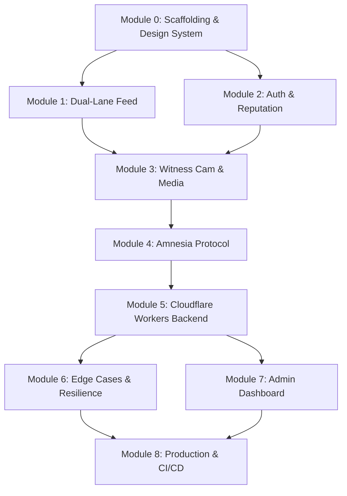

# CivicVoice — Modular Implementation Plan

> **Goal**: Build a production-ready civic whistleblowing platform on Cloudflare's edge stack (Pages, Workers, D1, R2) with an "Editorial Brutalism" UI, zero-knowledge anonymity, and verified media evidence.

> **Approach**: 9 sequential modules. Each module has a **Verification Gate** — a set of tests that **must all pass** before the next module begins.

---

## Source Documents

| Doc | Role |
|---|---|
| [Technical Blueprint](file:///c:/Users/User/Desktop/CivicVoice/CivicVoice/CivicVoice_Technical_Blueprint_Cloudflare.md) | Architecture, D1 schema, R2 storage, CI/CD |
| [Security & Edge Cases](file:///c:/Users/User/Desktop/CivicVoice/CivicVoice/CivicVoice_Security_EdgeCase_Protocol.md) | Amnesia protocol, anti-spoofing, cost defense |
| [UI/UX Strategy](file:///c:/Users/User/Desktop/CivicVoice/CivicVoice/CivicVoice_UIUX_Strategy.md) | Editorial Brutalism aesthetic, motion, typography |
| [Component Spec](file:///c:/Users/User/Desktop/CivicVoice/CivicVoice/CivicVoice_Component_Spec.md) | CSS variables, Witness Card, Witness Cam, Amnesia Audit |
| [Feature Goal Matrix](file:///c:/Users/User/Desktop/CivicVoice/CivicVoice/CivicVoice_Feature_Goal_Matrix.md) | Feature→Goal mapping, constraints |

## Infrastructure Status

| Service | Status | Action |
|---------|--------|--------|
| Cloudflare Account | ✅ Active | `Krafta.dev@gmail.com` |
| Cloudflare MCP | ✅ Connected | D1/KV/Workers accessible via MCP |
| D1 Database | 🔲 Not created yet | Will create in Module 5 via MCP |
| R2 Storage | ⏳ Deferred | Requires credit card — enable before Module 5 |
| Domain | 🔲 Using `*.pages.dev` | Buy `civicvoice.ng` before production |

> [!WARNING]
> **R2 must be enabled before starting Module 5.** Modules 0–4 can be built without it.

---

## Module Dependency Graph

---

## Module 0: Project Scaffolding & Design System

**Goal**: Initialize a Vite + React project for Cloudflare Pages, implement the full "Editorial Brutalist" design system, and confirm local development works.

**Source Docs**: Technical Blueprint §1–§2, UI/UX Strategy §2, Component Spec (Global CSS Variables)

### Proposed Changes

#### [NEW] `package.json` / project root
- Initialize Vite + React + TypeScript project (`npm create vite@latest`)
- Configure `wrangler.toml` for local Pages development
- Add PWA manifest (`manifest.json`) targeting Nigerian mobile users
- React Router for client-side routing

#### [NEW] `src/styles/globals.css`
- Implement all CSS custom properties from Component Spec:
  - `--bg-raw: #FBFBFA`, `--text-main: #0D1117`, `--truth-emerald: #059669`, `--caution-amber: #D97706`
  - `--border-weight: 2px`, `--font-serif: 'Fraunces'`, `--font-body: 'Newsreader'`, `--font-data: 'JetBrains Mono'`
- Global typography system, spacing scale (24px gutters), animation defaults (`cubic-bezier(0.16, 1, 0.3, 1)`)
- Dark mode ("Security Mode") using `--text-main` as background

#### [NEW] `src/components/ui/` — Core UI primitives
- `Button.tsx` — heavy-bordered brutalist buttons
- `Card.tsx` — 2px solid borders, 4px radius, hover expansion to 4px
- `Badge.tsx` — Emerald and Amber status badges
- `Layout.tsx` — Asymmetric Bento grid system

#### [NEW] `index.html` + `src/main.tsx`
- Google Fonts loading (Fraunces, Newsreader, JetBrains Mono)
- SEO meta tags, PWA link, viewport for mobile

### Verification Gate 0

| # | Test | Method | Pass Criteria |
|---|------|--------|---------------|
| 0.1 | Project builds locally | `npm run dev` | Dev server at `localhost:5173` loads without errors |
| 0.2 | Fonts load correctly | Browser → DevTools → Network | All 3 Google Fonts (Fraunces, Newsreader, JetBrains Mono) loaded |
| 0.3 | CSS variables applied | Browser → DevTools → Computed Styles | Background is `#FBFBFA`, borders are 2px solid |
| 0.4 | Card component renders | Navigate to a test page | Card shows with 2px border, 4px radius, hover expands to 4px |
| 0.5 | PWA manifest valid | Lighthouse PWA audit | Manifest detected, icons present |
| 0.6 | Cloudflare Pages build | `npx wrangler pages dev ./dist` | Pages serves the built SPA locally |
| 0.7 | React Router works | Click between routes | Pages navigate without full reload |

---

## Module 1: Dual-Lane Feed (Social vs. Whistle)

**Goal**: Build the two-lane content feed — a "Social" lane for opinions and a "Whistle" lane for verified evidence — with the Bento Ledger layout and staggered reveal animation.

**Source Docs**: Feature Goal Matrix §"Interact and air opinions" + §"Blow whistle with proofs", UI/UX Strategy §2.3 + §2.4

### Proposed Changes

#### [NEW] `src/components/feed/FeedToggle.tsx`
- Tab-style switch between "Social / Airing" and "Witness / Whistle" lanes
- Visual indicator using Emerald for Witness lane

#### [NEW] `src/components/feed/WitnessCard.tsx`
- Implements Component Spec "Witness Card" — 2px border, pulse Emerald stamp on hover
- Displays geo-label, content hash preview, witness score
- "Witness" posts rendered at 2x size vs "Opinion" posts (Asymmetric Grid)

#### [NEW] `src/components/feed/OpinionCard.tsx`
- Lighter-weight card for social/opinion posts
- Standard 1x grid sizing

#### [NEW] `src/components/feed/EvidenceFrame.tsx`
- Wraps uploaded media in the "Technical Frame" (top bar: region, bottom bar: SHA-256 hash)

#### [NEW] `src/components/feed/StaggeredFeed.tsx`
- Container that applies slide-up entrance with 0.05s stagger between cards

#### [NEW] `src/pages/Home.tsx` (Home / Feed page)
- Renders the dual feed with mock data
- Applies Bento Ledger asymmetric grid layout

### Verification Gate 1

| # | Test | Method | Pass Criteria |
|---|------|--------|---------------|
| 1.1 | Feed toggle works | Click "Social" / "Witness" tabs | Feed switches lanes; only correct card type shows |
| 1.2 | Asymmetric grid renders | Visual inspection | Witness cards are 2x width of Opinion cards |
| 1.3 | Staggered animation plays | Page load observation | Cards slide up sequentially with stagger delay |
| 1.4 | Evidence Frame renders | View a Witness card with media | Top bar shows region, bottom bar shows hash |
| 1.5 | Emerald stamp hover | Hover over Witness card | Border expands to 4px, Emerald icon pulses |
| 1.6 | Mobile responsive | DevTools → iPhone SE viewport | Feed stacks to single column, cards still readable |

---

## Module 2: Zero-Knowledge Auth & Reputation Engine

**Goal**: Implement stateless authentication (no PII), anonymous device-based identity, and the reputation/trust scoring system.

**Source Docs**: Feature Goal Matrix §"Option to remain anonymous" + §"Option to create an account", Security Protocol §1, Technical Blueprint §4.2

### Proposed Changes

#### [NEW] `src/lib/auth/anonymousAuth.ts`
- Generate deterministic `anon_token` from device fingerprint (hashed, non-reversible)
- No email, phone, or NIN required
- Session stored in `httpOnly` cookie with short TTL

#### [NEW] `src/lib/auth/reputationEngine.ts`
- Reputation scoring logic:
  - Points awarded for verified reports, peer upvotes
  - Location Diversity weighting (anti-Sybil: 100 same-tower votes = 1 point)
  - Level calculation: `Junior` (0-999) → `Advanced` (1000+)
- Video upload gating check: `reputationScore >= 1000`

#### [NEW] `src/components/auth/CryptoHandle.tsx`
- Optional persistent handle (e.g., `@LekkiWitness`)
- Displays reputation level badge (Junior / Advanced)

#### [NEW] `src/pages/Profile.tsx`
- User profile page showing reputation score, level, and handle
- "Amnesia Audit" section placeholder (implemented in Module 4)

### Verification Gate 2

| # | Test | Method | Pass Criteria |
|---|------|--------|---------------|
| 2.1 | Anonymous session created | Load app for first time | `anon_token` generated and stored in cookie |
| 2.2 | No PII stored | Inspect cookie + localStorage | No email, phone, IP, or NIN anywhere |
| 2.3 | Reputation score computes | Unit test `reputationEngine.ts` | Score increments on verified report, Sybil weighting works |
| 2.4 | Level gating works | Unit test with score < 1000 and ≥ 1000 | Video upload blocked below 1000, allowed at or above 1000 |
| 2.5 | Crypto handle renders | Navigate to profile | Handle and reputation badge display correctly |
| 2.6 | Session is stateless | Restart server, check Worker memory | No session data persists server-side |

---

## Module 3: Witness Cam & Media Pipeline

**Goal**: Build the in-app camera capture system, client-side media processing (compression, EXIF stripping, pitch shifting), and the upload pipeline.

**Source Docs**: Feature Goal Matrix §"Blow whistle with proofs" + §"File and Photo uploads" + §"Video uploads", UI/UX Strategy §3, Component Spec (Witness Cam), Security Protocol §1.2

### Proposed Changes

#### [NEW] `src/components/witness/WitnessCam.tsx`
- Full-screen camera UI with black background + film grain SVG overlay
- Oversized circular capture buttons with heavy borders
- Photo, audio, and video (15s max, gated by reputation) capture modes
- Real-time audio waveform: white → Emerald when GPS lock achieved

#### [NEW] `src/lib/media/metadataScrubber.ts`
- Client-side EXIF stripping using `exif-js` or equivalent
- Removes author, device ID, GPS from photo metadata
- Implements the `scrubMedia()` function from Feature Goal Matrix

#### [NEW] `src/lib/media/compressor.ts`
- Client-side compression using `ffmpeg.wasm`
- Target: no upload exceeds 5MB regardless of original size
- Payload caps: Images ≤ 5MB, Audio ≤ 10MB, Video ≤ 25MB

#### [NEW] `src/lib/media/geoStamp.ts`
- Browser Geolocation API integration
- Generates anonymized geo-label (e.g., "Ikeja District") from coordinates
- Attaches timestamp and geo-label to media as cryptographic stamp

#### [NEW] `src/lib/media/voiceDisguise.ts`
- "Sor Soke" mode: Web Audio API pitch shifting for voice anonymization

#### [NEW] `src/components/witness/SubmissionFlow.tsx`
- Multi-step submission: Capture → Preview → Scrub → Submit
- "Amnesia Wipe" animation (static/noise texture sweep) after submission

### Verification Gate 3

| # | Test | Method | Pass Criteria |
|---|------|--------|---------------|
| 3.1 | Camera opens on `/report` | Navigate to report page | Camera viewfinder renders with film grain overlay |
| 3.2 | Photo capture works | Take a photo | Preview shows captured image |
| 3.3 | EXIF stripped | Unit test `metadataScrubber.ts` with EXIF-laden test image | Output file has zero EXIF data |
| 3.4 | Compression works | Unit test with >5MB image | Output ≤ 5MB |
| 3.5 | Geo-stamp attaches | Allow location permission, capture | Geo-label (e.g., "Lagos District") appears on evidence frame |
| 3.6 | Voice disguise works | Record audio with "Sor Soke" enabled | Playback is pitch-shifted |
| 3.7 | Video gated by reputation | Attempt video with Junior account | Video mode disabled; enabled with Advanced account |
| 3.8 | Amnesia Wipe animation | Submit a report | Static sweep animation plays after submission |
| 3.9 | Rejected without scrub | Unit test: submit raw file (scrub disabled) | Submission rejected |

---

## Module 4: Amnesia Protocol & Security Hardening

**Goal**: Implement the full "Amnesia" security standard — IP purging, header deletion, stateless execution, CSP, and the Amnesia Audit UI.

**Source Docs**: Security Protocol §1 + §5, Component Spec (Amnesia Audit), Feature Goal Matrix §"Amnesia Constraint"

### Proposed Changes

#### [NEW] `workers/amnesia/headerPurge.ts`
- Worker middleware that deletes `x-real-ip`, `cf-connecting-ip` headers
- Extracts `CF-IPCountry` for geo-verification, then discards

#### [NEW] `workers/amnesia/logSuppression.ts`
- Configuration to disable Cloudflare Request Logs for `/api/report`

#### [MODIFY] `vite.config.ts` + `public/_headers`
- Add strict Content Security Policy headers via Cloudflare Pages `_headers` file:
  - `connect-src`: Only `*.cloudflare.com` and specific API domains
  - `camera`: Only allowed on `/report` route

#### [NEW] `src/components/profile/AmnesiaAudit.tsx`
- "Digital Terminal" styled audit display:
  - `[OK] IP LOG PURGED`
  - `[OK] SESSION ROTATED`
  - `[OK] METADATA STRIPPED`
- Scanning animation that ticks off items sequentially

### Verification Gate 4

| # | Test | Method | Pass Criteria |
|---|------|--------|---------------|
| 4.1 | Headers purged | Unit test `headerPurge.ts` with mock request | Output request has no `x-real-ip` or `cf-connecting-ip` |
| 4.2 | CSP headers set | Browser DevTools → Response Headers | `Content-Security-Policy` present with correct directives |
| 4.3 | Camera restricted to `/report` | Attempt camera access on home page | Browser blocks camera; allowed on `/report` |
| 4.4 | Amnesia Audit renders | Navigate to profile | Terminal-style audit display with scanning animation |
| 4.5 | No PII in Worker logs | Inspect Wrangler local logs after submission | Zero IP addresses or session tokens in output |

---

## Module 5: Cloudflare Workers Backend (D1, R2)

> [!CAUTION]
> **Prerequisite**: R2 must be enabled in Cloudflare Dashboard before starting this module. D1 can be created via MCP immediately.

**Goal**: Build the full backend: the `/api/report` Worker endpoint, D1 database schema, R2 media storage, and the Emerald verification stamp logic.

**Source Docs**: Technical Blueprint §3 + §4 + §5, Security Protocol §2 + §3

### Proposed Changes

#### [NEW] `workers/api/report.ts`
- The "Amnesia Endpoint":
  1. Receive multipart form (media + geo-coords)
  2. Validate geo via `cf-ipcountry` vs Browser Geolocation (Dual-Key)
  3. Strip metadata server-side (failsafe)
  4. Stream media to R2
  5. Log report to D1 with `report_id`, `media_key`, `geo_label`, `witness_score`, `content_hash`
  6. Stateless execution — no data persists in Worker memory

#### [NEW] `workers/api/feed.ts`
- Fetch reports from D1 for feed display
- Filter by lane (Social / Witness)
- Pagination support

#### [NEW] `workers/api/reputation.ts`
- Reputation CRUD: fetch score, update on verified report/upvote
- Location Diversity anti-Sybil logic

#### [NEW] `db/schema.sql`
- D1 tables: `witness_reports` and `anon_reputation` per Technical Blueprint §4

#### [NEW] `wrangler.toml` (update)
- D1 database binding, R2 bucket binding
- Worker routes for `/api/report`, `/api/feed`, `/api/reputation`

#### [NEW] `workers/api/verification.ts`
- Dual-Key verification logic (Network vs Device location)
- Assigns "Witness Verified" or "Remote Verified" status
- Emerald Badge assignment for verified reports

### Verification Gate 5

| # | Test | Method | Pass Criteria |
|---|------|--------|---------------|
| 5.1 | D1 schema created | `wrangler d1 execute` with schema.sql | Tables `witness_reports` and `anon_reputation` exist |
| 5.2 | Report submission works | POST to `/api/report` with test payload | 200 OK, record in D1, media in R2 |
| 5.3 | Report appears in feed | GET `/api/feed?lane=witness` | Submitted report returned in response |
| 5.4 | Dual-Key verification | Submit with matching geo → Witness Verified | Correct status assigned |
| 5.5 | Dual-Key VPN case | Submit with mismatched geo → Remote Verified | "Remote Verified" status, not blocked |
| 5.6 | R2 media accessible | Fetch media by `media_key` | Media loads correctly |
| 5.7 | Rate limiting enforced | Submit >3 reports in 1 hour from same device | 4th submission rejected with 429 |
| 5.8 | Payload caps enforced | Submit >5MB image | Rejected with 413 |
| 5.9 | R2 lifecycle cleanup | Leave "Pending" upload unlinked for 24h | Auto-deleted from R2 |

---

## Module 6: Edge Cases & Resilience

**Goal**: Handle real-world failure modes — 3G dropouts, censorship/DNS blocking, deepfake detection, and Sybil attacks.

**Source Docs**: Security Protocol §2.2 + §4

### Proposed Changes

#### [NEW] `src/lib/resilience/resumableUpload.ts`
- Tus.io or custom resumable upload logic
- Store in-progress "Proof" in IndexedDB until 200 OK received

#### [NEW] `src/lib/resilience/mirrorSwitch.ts`
- If `civicvoice.ng` returns 502/timeout, auto-switch to secondary `worker.dev` mirror endpoint
- Client-side failover with exponential backoff

#### [NEW] `workers/api/audioGate.ts`
- Deepfake detection: flag audio with "too clean" noise floor (zero ambient noise)
- Flagged submissions go to community peer-review queue

#### [MODIFY] `src/lib/auth/reputationEngine.ts`
- Add Location Diversity weighting for anti-Sybil protection
- 100 upvotes from same cell tower = 1 effective upvote

#### [NEW] `src/components/feed/PeerReviewQueue.tsx`
- UI for community review of flagged submissions
- Advanced Witnesses can vote to verify or reject

### Verification Gate 6

| # | Test | Method | Pass Criteria |
|---|------|--------|---------------|
| 6.1 | Resumable upload works | Start upload, kill network, restore | Upload resumes and completes |
| 6.2 | IndexedDB persistence | Submit while offline | Data stored locally, syncs when online |
| 6.3 | Mirror failover works | Block primary domain | App auto-switches to mirror endpoint |
| 6.4 | Deepfake flagging | Upload "clean" audio (no ambient noise) | Submission flagged for peer review |
| 6.5 | Sybil protection | 100 upvotes from same location | Counts as 1 effective upvote in reputation |
| 6.6 | Peer review queue renders | Navigate to review queue | Flagged submissions displayed for review |

---

## Module 7: Admin Dashboard & Observability

**Goal**: Build a protected super admin dashboard for platform health monitoring, content moderation, and operational visibility. Lean but production-essential.

**Source Docs**: Technical Blueprint §4 (D1 schema), Security Protocol §3 (cost defense)

### Proposed Changes

#### [NEW] `src/pages/admin/AdminDashboard.tsx`
- Protected route — only accessible via admin secret token (stored as Worker Secret)
- Dark "Security Mode" aesthetic (Deep Obsidian background)
- Bento grid layout with real-time stat cards

#### [NEW] `src/components/admin/PlatformHealthPanel.tsx`
- **Live Pulse**: Total reports today, total active sessions, reports per hour sparkline
- **Storage Meter**: R2 usage (GB used vs budget cap) with amber/red warnings
- **D1 Stats**: Query count, rows in `witness_reports` and `anon_reputation`
- **Worker Health**: Invocations, error rate %, p50/p99 latency

#### [NEW] `src/components/admin/ContentModerationPanel.tsx`
- **Pending Queue**: Reports flagged for peer review (from deepfake gating)
- **Quick Actions**: Approve / Reject / Escalate buttons
- **Report Detail View**: Media preview, geo-label, content hash, verification status
- **Flagged Content Counter**: How many items awaiting review

#### [NEW] `src/components/admin/UserActivityPanel.tsx`
- **Reputation Distribution**: Bar chart showing Junior vs Advanced user counts
- **Top Contributors**: Highest reputation anonymous handles (no PII exposed)
- **Sybil Alerts**: Flagged clusters of same-location upvotes
- **Rate Limit Hits**: How many 429s served today (potential abuse signals)

#### [NEW] `src/components/admin/CostMonitorPanel.tsx`
- **R2 Storage**: Current usage with projected monthly cost
- **D1 Reads/Writes**: Daily count vs free tier limits (5M reads, 100K writes)
- **Worker Invocations**: Daily count vs free tier (100K/day)
- **Budget Alert**: Amber when at 70% of free tier, Red at 90%

#### [NEW] `src/components/admin/ActivityLogPanel.tsx`
- **Recent Actions Feed**: Last 50 platform events (new report, verification, flagged content)
- Each entry shows: timestamp (JetBrains Mono), event type, geo-label
- No PII — log entries reference `anon_token` hashes, never real identities

#### [NEW] `workers/api/admin.ts`
- Admin API endpoints (all protected by admin secret):
  - `GET /api/admin/stats` — aggregated platform metrics from D1
  - `GET /api/admin/moderation` — pending flagged content
  - `POST /api/admin/moderate` — approve/reject flagged items
  - `GET /api/admin/activity` — recent activity log
- All queries hit D1 directly, no external services

#### [NEW] `db/schema.sql` (update)
- Add `admin_activity_log` table:
  - `event_id` UUID, `event_type` ENUM, `target_id` String, `geo_label` String, `created_at` Timestamp
- Add `platform_metrics` table (daily snapshots):
  - `date` Date, `total_reports` Int, `total_users` Int, `flagged_count` Int, `storage_bytes` Int

### Verification Gate 7

| # | Test | Method | Pass Criteria |
|---|------|--------|---------------|
| 7.1 | Admin route protected | Navigate to `/admin` without token | Access denied, redirected |
| 7.2 | Admin route accessible | Navigate to `/admin` with valid token | Dashboard loads with all panels |
| 7.3 | Health panel shows live data | Check after submitting test reports | Correct report count, storage reading |
| 7.4 | Moderation queue works | Flag a report, check admin panel | Flagged report appears in queue |
| 7.5 | Approve/reject works | Click approve on flagged item | Item removed from queue, status updated in D1 |
| 7.6 | Cost monitor accuracy | Compare panel numbers to Cloudflare dashboard | Numbers match within 5% |
| 7.7 | Activity log populates | Perform actions, check log | Events appear in chronological order |
| 7.8 | No PII in admin views | Inspect all admin API responses | Zero real IPs, emails, or device IDs |

---

## Module 8: Production Deployment & CI/CD

**Goal**: Deploy to Cloudflare production with GitHub Actions CI/CD, final security audit, performance optimization, and Turnstile CAPTCHA.

**Source Docs**: Technical Blueprint §6 + §7, Security Protocol §5

### Proposed Changes

#### [NEW] `.github/workflows/deploy.yml`
- GitHub Actions pipeline:
  - PR to `main` → Cloudflare Preview URL generated
  - Merge to `main` → Production deploy in <60s
  - `gitleaks` secret scanning on every push

#### [NEW] `.github/workflows/security.yml`
- Automated `gitleaks` scan
- CSP header validation
- Dependency vulnerability audit

#### [MODIFY] `wrangler.toml`
- Production bindings: D1, R2, Worker Secrets
- Secret management via `wrangler secret put` (PayStack, Google Maps keys)

#### [NEW] `src/components/ui/Turnstile.tsx`
- Cloudflare Turnstile CAPTCHA on the Submit button
- Privacy-first: no cookies, no tracking

#### Performance Optimization
- Lighthouse audit targeting 90+ on mobile 3G
- Image/font optimization for low-bandwidth
- Service Worker caching for PWA offline support

### Verification Gate 8

| # | Test | Method | Pass Criteria |
|---|------|--------|---------------|
| 8.1 | CI/CD pipeline runs | Push to feature branch → open PR | Preview URL generated automatically |
| 8.2 | Production deploy works | Merge PR to `main` | Live site updates within 60s |
| 8.3 | Gitleaks passes | Push commit with no secrets | Scan completes clean |
| 8.4 | Gitleaks catches secrets | Push commit with dummy API key | Pipeline fails, secret flagged |
| 8.5 | Turnstile blocks bots | Submit without solving Turnstile | Submission rejected |
| 8.6 | Lighthouse mobile score | Run Lighthouse on production URL (Slow 3G) | Performance ≥ 90, PWA badge |
| 8.7 | All Worker Secrets set | `wrangler secret list` | All required secrets present, none in code |
| 8.8 | End-to-end flow | Full user journey: load → browse → submit report → admin reviews → verified in feed | All steps succeed |

---

---

## Technology Decisions (Resolved)

### 1. Framework: **Vite + React** ✅ (not Next.js)

| | Next.js on Cloudflare | Vite + React on Cloudflare |
|---|---|---|
| **Adapter** | Requires `@cloudflare/next-on-pages` (third-party adapter) | Native — Cloudflare Pages serves static SPA directly |
| **SSR** | Partial support, many Next.js features unsupported at edge | Not needed — our backend is Workers, frontend is a PWA/SPA |
| **Build speed** | Slower (Next.js is heavy) | Faster (Vite is built for speed) |
| **Complexity** | Higher — Next.js has opinions that conflict with Cloudflare | Lower — Vite outputs plain static files |
| **Solo dev maintainability** | Harder — version conflicts between Next.js and adapter | Easier — fewer dependencies, fewer breaking changes |

> [!TIP]
> **Why not Next.js?** Your architecture is a **PWA/SPA** (frontend) + **Cloudflare Workers** (backend API). Next.js SSR adds complexity you don't need. The edge logic (Amnesia Protocol, geo-verification) lives in Workers, not in the framework. Vite + React gives you maximum control with minimum friction on Cloudflare.

### 2. Domain: **`*.pages.dev`** for testing ✅

- Cloudflare Pages provides a **free subdomain**: `civicvoice.pages.dev`
- Every PR gets a **unique preview URL**: `abc123.civicvoice.pages.dev`
- Workers get `*.workers.dev` endpoints
- **No domain purchase needed until production launch** — just point `civicvoice.ng` to Cloudflare when ready

### 3. Database: **Cloudflare D1** ✅ (not Firebase or Supabase)

| | Firebase Firestore | Supabase (PostgreSQL) | Cloudflare D1 |
|---|---|---|---|
| **Edge latency (West Africa)** | ❌ High — nearest region is Europe | ❌ High — hosted in single region | ✅ Zero — runs at the edge alongside Workers |
| **Egress cost** | ❌ Charges per read | ⚠️ Free tier, then charges | ✅ $0 egress |
| **Auth model** | ❌ Firebase Auth stores PII (email, phone) — conflicts with Amnesia Protocol | ⚠️ Supabase Auth also stores PII | ✅ No built-in auth — we build zero-knowledge auth exactly as designed |
| **Data model fit** | ⚠️ NoSQL — reputation queries are awkward | ✅ Full PostgreSQL | ✅ SQLite — perfect for simple relational data (reports + reputation) |
| **Solo dev ops** | ⚠️ Separate console, separate billing | ⚠️ Separate console, separate billing | ✅ Same Wrangler CLI, same Cloudflare dashboard, one bill |
| **R2 integration** | ❌ Needs custom bridging | ❌ Needs custom bridging | ✅ Native binding — Workers talk to D1 and R2 in the same execution context |
| **Scalability** | ✅ Auto-scales | ✅ Auto-scales | ✅ Auto-scales at edge |

> [!IMPORTANT]
> **Why not Firebase?** Firebase Firestore's authentication model stores PII (email, phone, IP logs) which **directly contradicts** the Amnesia Protocol. Firestore also has no edge presence in West Africa — every database read from Lagos hits a European or US server, adding 200ms+ latency. D1 runs **at the same Cloudflare edge** as your Workers, so a Lagos user hits a Lagos PoP with ~5ms latency.

> [!TIP]
> **Why not Supabase?** Supabase is excellent, but for this project it adds a second infrastructure, a second console, and external network hops. With D1, your Worker talks to the database in the **same execution context** — like calling a local function. For a solo developer, one stack (Cloudflare) is easier to manage than two (Cloudflare + Supabase).

### 4. Solo Developer Scalability Strategy

- **One stack**: Cloudflare (Pages + Workers + D1 + R2 + WAF + Turnstile) — everything in one dashboard, one CLI (`wrangler`), one bill
- **AI-agent friendly**: Vite + React codebase is simple and conventional — AI coding agents (Claude/Antigravity) can read, write, and test it without fighting framework magic
- **Zero server management**: No VMs, no Docker, no Kubernetes. Workers auto-scale to millions of requests
- **Cost ceiling**: D1 free tier = 5M reads/day, R2 = $0 egress. You can serve thousands of Nigerian users before hitting paid tier

> [!NOTE]
> **Module ordering is flexible within limits**: Modules 1 and 2 can be built in parallel since they share only Module 0 as a dependency. All other modules must be sequential.
